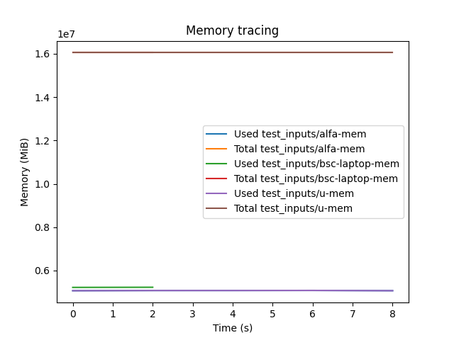

# MemoryTracing

A simple environment to trace and plot memory usage on a linux server

## Requeriments
The **matplotlib** package is required to run this. You can install with the requirements file or do it manually.

```bash
pip install -r requirements.txt
```


## Usage example

1. Before running your app, launch the free command on the background. Use `-s` option for enable the sampling and redirect the output into a file.
2. Store the PID to kill it after you app finishes
3. Launch your application
4. Kill the `free` command with `kill $PID_FREE`
5. Launch `postprocess.py -f $FREE_FILE -s $SAMPLING_TIME` to generate the plot.
   
The `run.sh` script contains all these steps.


